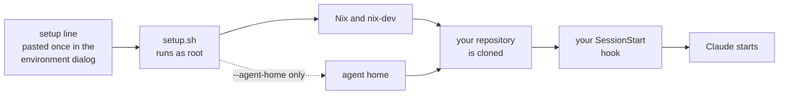

# claudinix

<!-- BEGIN badges -->
[](https://github.com/pr0d1r2/claudinix/actions/workflows/ci.yml)
[](LICENSE)
[](docs/FACTS.md)

[](flake.nix)
[](setup.sh)
[](https://pr0d1r2.cachix.org)

[](hk.pkl)
[](hk.pkl)
[](tests/unit)
[](SPEC.md)

[](https://claude.com/claude-code)
[](SPEC.md)
<!-- END badges -->

*Claude in cloud on Nix.*

> **Unofficial.** claudinix is a community project. It is not affiliated
> with, endorsed by, or sponsored by Anthropic. "Claude" and "Claude Code"
> are trademarks of Anthropic.

Read [LLM-DISCLAIMER](docs/LLM-DISCLAIMER.md) first.

**Nix, and your flake's dev shell, inside Claude Code cloud sessions.**

Your repository is a Nix flake and you use Claude Code cloud sessions.
claudinix makes Nix, and `nix develop` in your repository, work inside those
sessions, before Claude starts.

**Why.** A cloud session is an Ubuntu VM with no toolchain for your
repository, a network proxy that refuses hosts you did not list, and a GitHub
proxy that returns a 403 for the archive downloads Nix uses for `github:`
flake inputs. Getting `nix develop` to work there took seven probe sessions;
the results are in [`docs/FACTS.md`](docs/FACTS.md) so you do not have to
repeat them.

> **Alpha, 2026-10-03.** Proven in real cloud sessions: Nix and the cache
> work, the dev shell of a real Rust project builds in about 33 seconds, and
> `claude --cloud "<task>" --model sonnet` runs on Sonnet 5.5. Not yet run in
> a real session: the agent home, `nix-dev`, the probe launcher, and the
> setup line's download of `setup.sh` from `raw.githubusercontent.com`
> during setup. All of them are covered by tests with stubs. Evidence and
> dates: [`docs/FACTS.md`](docs/FACTS.md).

<!-- BEGIN setup-line -->
No release yet: the maintainer publishes the line with `scripts/release.sh record`, then `scripts/release.sh publish`.
<!-- END setup-line -->

## Quickstart

In your project (a Nix flake with a committed `flake.lock`, on GitHub, branch
pushed), with Nix and flakes on your machine and the `claude` CLI signed in:

```sh
nix run github:pr0d1r2/claudinix#guide
```

1. **Run the guide** (above). It walks you through the setup and checks what
   it can. Creating the environment itself is the one part you do by hand at
   [claude.ai/code](https://claude.ai/code).
2. **Choose the environment** in `claude` with `/remote-env`; the guide then
   pins it to the project.
3. **Run a first session** and look for a Nix version and `DEVSHELL-OK`:

   ```sh
   claude --cloud "Run: nix --version && nix-dev -c true && echo DEVSHELL-OK. Report the output." --model sonnet
   ```

Before the first session, check that usage credits (metered overage) are OFF
([`docs/SETUP.md`](docs/SETUP.md), step 0).

## What it is, and what it is not

- **It is** a setup script that installs Nix and `nix-dev` on the session VM
  before Claude starts, and a few commands for your machine that prepare your
  project for that ([`docs/CLI.md`](docs/CLI.md)).
- **It is** a record of what a cloud session looks like, measured and dated
  ([`docs/FACTS.md`](docs/FACTS.md)).
- **It is not** a toolchain installer. Your repository's tools come from its
  own flake dev shell.
- **It is not** a way to create the environment for you: claude.ai has no API
  for that, so you paste the values by hand.
- **It is not** official. See the notice at the top.

## How the pieces fit



The setup line and the script run when a snapshot is built, not on every
session, so per-session work belongs in your SessionStart hook. The full
sequence is in [`docs/SESSION.md`](docs/SESSION.md).

## Do you need this?

Not if your repository is not a Nix flake: claudinix only makes `nix develop`
work in a session, and installs nothing else for your project. Not if you only
run Claude Code on your own machine: nothing here reaches a local session.
It helps when your flake's dev shell is the toolchain you want Claude to use in
the cloud, and `nix develop` fails there out of the box.

## About the guide

The first `nix run github:pr0d1r2/claudinix#guide` asks whether to trust the extra binary cache
`pr0d1r2.cachix.org`: answer `y`, or pass `--accept-flake-config`. The guide
walks you through every step in your terminal and the browser, copies each
value you have to paste, and checks what it can. Creating the environment
itself is the one part that has to happen by hand at
[claude.ai/code](https://claude.ai/code), because it has no API. The setup
script you paste there is the line published above (and in each release's
notes). Until the first release there is no published line: the block above
says so, and the guide stops with "no release yet". Until then, a maintainer
or tester can print a line for a commit CI passed with `guide --rev SHA` or
`scripts/setup-line.sh SHA` (both need `gh`, signed in; a short SHA works,
and the guide names the newest green commit). The same steps, written out, are in [`docs/SETUP.md`](docs/SETUP.md).

## The agent home is opt-in

By default the setup script installs Nix and `nix-dev` and nothing else. It
also installs an **agent home** only if you ask for it, by adding
`--agent-home` to the setup line (or setting `CLAUDINIX_AGENT_HOME=1`).
Without it, setup prints
`agent home: skipped -- opt in with setup.sh [SHA] --agent-home, or CLAUDINIX_AGENT_HOME=1`.

The agent home is the owner's own Claude setup, activated for the session's
user (root) before Claude starts. It installs:

- the owner's set of rules, in `~/.claude/rules`;
- the cavekit skills `spec`, `build`, `check`, `backprop` and `caveman`, and
  the `FORMAT.md` they read;
- a `claude-code` home-manager configuration;
- [rtk](https://github.com/rtk-ai/rtk), whose Claude Code hook rewrites
  each Bash command to `rtk <cmd>` so its output comes back condensed, with
  its `RTK.md` loaded from `~/.claude/CLAUDE.md`. Setup links rtk into
  `/usr/local/bin` beside `nix`;
- a narrow list of permissions that pre-approves the gate's own commands and
  pushing `claude/*` branches in cloud sessions, and denies pushing `main`
  (`nix/cloud-permissions.json`). It is written to `~/.claude/settings.json`,
  so it never reaches a local session.

**It changes how Claude behaves in your sessions.** Read what it installs
(`nix/cloud-home.nix`) before you opt in. It holds agent-level settings only:
no language toolchain, which stays with your repository's own dev shell.

## What you get

- **A setup script** ([`setup.sh`](setup.sh)). It uses the Nix the image
  already ships (2.34.6 when measured on 2026-10-03) and installs the pinned
  2.35.2 only if the image falls below the floor of 2.34. The installer runs
  only after its sha256 matches. It writes one managed block into
  `/etc/nix/nix.conf` (flakes on, `accept-flake-config = true`, the read-only
  cache `pr0d1r2.cachix.org`), links `nix` into `/usr/local/bin` so the Bash
  tool finds it without sourcing a profile, and installs `nix-dev`. With
  `--agent-home` it also activates the agent home (above). In the
  environment dialog you paste one line, pinned to a commit SHA; the line
  downloads `setup.sh` at that commit and runs it.
- **Commands for your project** ([`docs/CLI.md`](docs/CLI.md)), run from
  the project you will send to the cloud with
  `nix run github:pr0d1r2/claudinix#<app>`:
  `inputs` lists which of your flake's `github:` inputs a session can get
  from a binary cache (`cached`) and which it would have to fetch from GitHub
  (`uncached`); `domains` prints the allowed domains your project needs;
  `guide` walks you through the setup steps and checks what it can; `probe`
  starts a cloud session that probes your project and prints its report.
  Inside a session, `nix-dev` is `nix develop` with a failover for the GitHub
  proxy.
- **The environment as files.** [`allowlist.txt`](allowlist.txt) is the list
  of allowed domains and [`env-names.txt`](env-names.txt) the environment
  variables. The claude.ai environment dialog has no API, so you paste from
  these files by hand.
- **A probe** ([`probe.sh`](probe.sh)). Run it inside a session to print the
  session facts and the health of Nix, one line per check.
- **The facts** ([`docs/FACTS.md`](docs/FACTS.md)): uid, network, proxy
  behaviour, timings and cost, each with the date it was measured.
- **A gate** ([`hk.pkl`](hk.pkl)) that checks all of the above on every
  commit, and the same gate in CI.

What it deliberately does not do is install your repository's toolchain. That
is your repository's own flake dev shell (`nix develop`), not an apt step
here. [`docs/CONSUMER.md`](docs/CONSUMER.md) says what your repository should
do.

## Set it up by hand

The guide above does all of this for you. The full walkthrough, with every
click, is [`docs/SETUP.md`](docs/SETUP.md). In short:

1. **Protect your money.** Claim any cloud credit and check that usage
   credits (metered overage) are OFF at
   [claude.ai/settings/usage](https://claude.ai/settings/usage), before any
   session.
2. **Prerequisites.** A claude.ai plan with cloud sessions, Claude Code signed
   in with that account, your repository on GitHub, a Nix flake with a
   committed `flake.lock`, and your branch pushed.
3. **Connect GitHub** to your claude.ai account (once).
4. **Create the environment** at [claude.ai/code](https://claude.ai/code):
   named after your project, network access **Custom** with the default package-manager
   list included, as allowed domains every non-comment line of
   `allowlist.txt` plus your project's hosts from
   `nix run github:pr0d1r2/claudinix#domains`, and as the setup script the
   one line published at the top of this page (not the contents of
   `setup.sh`). Until the first release there is no published line, and the
   guide stops with "no release yet"; maintainers and testers can use
   `guide --rev SHA` or `scripts/setup-line.sh SHA` (needs `gh`).
5. **Choose it in your terminal** with `/remote-env` and pin it to the
   project (once per project; the guide writes the pin).
6. **Run a first session** and look for a Nix version and `DEVSHELL-OK`:

   ```sh
   claude --cloud "Run: nix --version && nix-dev -c true && echo DEVSHELL-OK. Report the output." --model sonnet
   ```

The model is chosen when you start the session, not in the environment, and
the task text must come first: `claude --cloud "<task>" --model sonnet`.
Sessions started without `--model` ran on Opus (measured 2026-10-03). See
[`docs/MODEL.md`](docs/MODEL.md). For a worked run on a real repository, with
timings, see [`docs/EXAMPLE.md`](docs/EXAMPLE.md).

## Fork it

Three things are specific to the owner of this repository: the binary cache
host `pr0d1r2.cachix.org`, its public signing key, and the repository's own
name in GitHub URLs. To use your own cache, change them everywhere they
appear. [`docs/FORKING.md`](docs/FORKING.md) has the full walkthrough.

In [`setup.sh`](setup.sh) they sit in one fork config block at the top
(`cache_host`, `cache_key` and `repo`), and a fork edits only that block
there. A few other files hold them too (the allowlist, `flake.nix`, `probe.sh`,
some scripts, the CI workflow and the bats tests that assert them), and
[`docs/FORKING.md`](docs/FORKING.md) lists each one and what to change.

A fork can also set `cache.name` in its own `.claudinix.toml`; `inputs` and the
cache check then use it ([`docs/CONFIG.md`](docs/CONFIG.md)).

Your cache needs a push token, and that token lives only in your CI secrets.
It is never put on a session VM; from the VM the cache is read-only.

## A config file, if you want one

A repository can keep its choices (model, dev shell, extra domains, cache name)
in an optional `.claudinix.toml` at its root. Most repositories need none; see
[`docs/CONFIG.md`](docs/CONFIG.md).

## What you can check

Each claim here has a way to check it yourself.

- **The Nix installer runs only after its sha256 matches.** Read the check in
  [`setup.sh`](setup.sh) (`NIX_INSTALL_SHA256`); the bats tests in
  `tests/unit/setup.bats` run it against a fake installer. It only runs at all
  when the image's Nix is older than 2.34.
- **The setup line in this README is generated, not typed.**
  `scripts/guard/readme-setup-line.sh` regenerates the block between the
  `setup-line` markers and compares it; it is a step of the gate.
- **The agent home is off unless you ask.** Run `setup.sh` without
  `--agent-home` and it prints the `agent home: skipped` line.
- **The cache is read-only from the VM.** The push token `CACHIX_AUTH_TOKEN`
  appears only in the CI workflow and the docs that describe it, never in a
  setup script or an environment variable list.
- **Every fact about the platform is dated** and comes from a probe. Run
  [`probe.sh`](probe.sh) in a session to measure it again.
- **The gate passes on this repository.** `hk check --all` inside
  `nix develop` runs every check ([`docs/INTEGRATION.md`](docs/INTEGRATION.md)).

## Known limits

Each limit has a source, and the dates matter, because Anthropic can change
the platform at any time.

- **Platform.** Ubuntu 24.04 on x86_64, one root shell, no systemd (measured
  2026-10-03).
- **`github:` flake inputs fail with a 403** unless the repository is
  attached to the session. Use a binary cache for large inputs such as
  nixpkgs, or write small inputs as `git+https://github.com/<owner>/<repo>`.
  See [`docs/SETUP.md`](docs/SETUP.md) and [`docs/CONSUMER.md`](docs/CONSUMER.md).
- **Allowlist edits reach new sessions only.** A running session keeps the
  network rules it started with.
- **The snapshot is cached only if setup finishes in about five minutes.**
  Whether a second session really skips the setup script is not measured yet
  ([`docs/FACTS.md`](docs/FACTS.md), "Still open").
- **Skills placed in `~/.claude/skills` by the setup script** may or may not
  survive the session start. Not measured yet (same list).
- **Not yet run in a real cloud session:** see the alpha note at the top.
  Treat each of those as untested where it counts until a probe says
  otherwise.
- **Trust.** `accept-flake-config = true` lets any repository's `nixConfig`
  apply, and the setup script runs as root. Use the environment only with
  repositories you trust, and read [`docs/SECURITY.md`](docs/SECURITY.md).
- **Built by an LLM.** Read [`docs/LLM-DISCLAIMER.md`](docs/LLM-DISCLAIMER.md)
  and check the script you paste, at the commit you paste it from.

## Documentation

Start with [`docs/SETUP.md`](docs/SETUP.md) if you are new.

**Use it**

| doc | what is in it |
|---|---|
| [`docs/SETUP.md`](docs/SETUP.md) | browser and terminal steps, updating, troubleshooting |
| [`docs/EXAMPLE.md`](docs/EXAMPLE.md) | a real repository from zero to a green test run, with timings |
| [`docs/CLI.md`](docs/CLI.md) | the commands: flags, exit codes, output |
| [`docs/CONFIG.md`](docs/CONFIG.md) | the optional `.claudinix.toml`: every key, default and which tool reads it |
| [`docs/MODEL.md`](docs/MODEL.md) | which model sessions use and how to choose |

**Prepare your repository**

| doc | what is in it |
|---|---|
| [`docs/CONSUMER.md`](docs/CONSUMER.md) | what your repository does to work well in a session |
| [`docs/CACHE-CI.md`](docs/CACHE-CI.md) | the CI job that fills the binary cache from your repository |

**Understand it**

| doc | what is in it |
|---|---|
| [`docs/SESSION.md`](docs/SESSION.md) | what happens between `claude --cloud` and the first prompt |
| [`docs/FACTS.md`](docs/FACTS.md) | what a cloud session looks like, measured and dated |
| [`docs/SECURITY.md`](docs/SECURITY.md) | reporting, and what the attack surface is |
| [`docs/LLM-DISCLAIMER.md`](docs/LLM-DISCLAIMER.md) | how this was built and how to check it |

**Run your own**

| doc | what is in it |
|---|---|
| [`docs/FORKING.md`](docs/FORKING.md) | running this with your own cache and names |
| [`docs/RUNBOOK.md`](docs/RUNBOOK.md) | bump Nix, update the script, refill the cache, stop spend |

**Contribute**

| doc | what is in it |
|---|---|
| [`docs/CONTRIBUTING.md`](docs/CONTRIBUTING.md) | setup, the loop, and the one hard rule |
| [`docs/INTEGRATION.md`](docs/INTEGRATION.md) | the gate, step by step |
| [`docs/linter-coverage.md`](docs/linter-coverage.md) | which checks reach which files |
| [`SPEC.md`](SPEC.md) | the spec and the backlog |
| [`AGENTS.md`](AGENTS.md) | the working guide for agents and humans |
| [`CHANGELOG.md`](CHANGELOG.md) | what changes inside the session VM |
| [`docs/THIRD-PARTY-NOTICES.md`](docs/THIRD-PARTY-NOTICES.md) | other people's work this depends on |

## Reading the specs

`SPEC.md` files are caveman-encoded: the symbols carry meaning.

```
→ leads to    ∴ therefore    ∀ for all    ! must
⊥ never       ? open/optional ≤ at most    ∈ in
```

Sections run `§G` goal, `§F` federation, `§N` navigation, `§C` constraints,
`§I` interfaces, `§V` invariants, `§T` tasks and `§B` bugs.

## Contributing

- [docs/CONTRIBUTING.md](docs/CONTRIBUTING.md): setup, the loop, and the one
  hard rule
- [docs/CODE_OF_CONDUCT.md](docs/CODE_OF_CONDUCT.md)
- [AGENTS.md](AGENTS.md): the working guide, for agents and humans alike

## Security

The setup script runs as root on every fresh session VM. Report problems
privately, as [`docs/SECURITY.md`](docs/SECURITY.md) describes.

## License

MIT, see [`LICENSE`](LICENSE).

Two things this repository depends on are acknowledged in
[`docs/THIRD-PARTY-NOTICES.md`](docs/THIRD-PARTY-NOTICES.md).

## The name

"claud" reads as Claude or as cloud. "i nix" is Polish for "and nix". The
working name was `nix-claude-code-cloud`; the history keeps it.
