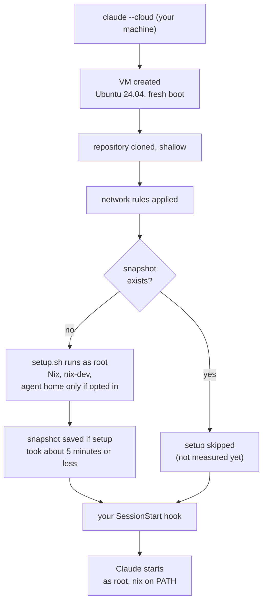

# What happens when a session starts

The path from `claude --cloud` to Claude's first prompt, and which part of
this repository runs where. It explains why some edits do not reach a session
that is already running. Anything not measured is marked as such; the
measurements are in [`FACTS.md`](FACTS.md), dated.

## The boot at a glance

The setup script runs only when there is no snapshot; your SessionStart hook
runs on every session. The steps in words:

## The boot, in order

1. **You launch.** `claude --cloud "<task>" --model sonnet` from a checkout
   of your repository. The model is fixed here and cannot change later
   ([`MODEL.md`](MODEL.md)). The task text must come right after `--cloud`.
2. **A VM is created.** An Anthropic-hosted Ubuntu 24.04 x86_64 machine with
   4 vCPUs and 15 GB of RAM. In probe 6 (2026-10-03) it had been up for 3
   minutes when the session started: a fresh boot.
3. **Your repository is cloned**, shallow, from the GitHub copy of your
   branch. Local commits you have not pushed are not there.
4. **The environment's network rules are applied.** Custom access, the
   default package-manager list, and the allowed domains you entered. They are
   fixed for this VM.
5. **The setup script runs, as root, if there is no snapshot.** This is
   [`setup.sh`](../setup.sh): it makes sure a Nix of at least 2.34 is present,
   writes the managed `nix.conf` block, links `nix` into `/usr/local/bin`, and
   installs `nix-dev` (`nix develop` with a failover for the GitHub proxy).
   Only with `--agent-home` (or `CLAUDINIX_AGENT_HOME=1`) does it also activate the
   agent home, the owner's Claude rules and skills; otherwise it prints that
   the agent home was skipped.
6. **A snapshot is saved** if the script finished within about five minutes.
   Later sessions in the same environment start from that snapshot and skip
   the script. A change to the script or the allowed domains, or about seven
   days, rebuilds it (`SPEC.md` C1). **Not measured yet:** whether a second
   session really skips the script, and how much faster it starts
   (`SPEC.md` T55).
7. **Your SessionStart hook runs**, if your repository has one. This is where
   per-session work belongs: `git fetch --unshallow`, installing hooks
   ([`CONSUMER.md`](CONSUMER.md)). It cannot live in the setup script,
   because a cached snapshot does not run that script again.
8. **Claude starts** as root with `HOME=/root` and `CLAUDE_CODE_REMOTE=true`,
   in your clone, with `nix` on the Bash tool's `PATH` without sourcing a
   profile.

Running processes do not survive a snapshot, so nothing the setup script
starts is still running when Claude does. This repository starts nothing.

## What is where

| part | where it lives | runs when |
|---|---|---|
| Nix, `nix.conf` block | the VM image plus `setup.sh` | setup, once per snapshot |
| `nix-dev`, and with `--agent-home` the agent home | `setup.sh` | setup, once per snapshot |
| Allowed domains | the environment (set in the browser) | fixed for each VM at creation |
| Environment variables | the environment | each session |
| Your repository | cloned from GitHub | each session |
| Your toolchain | your flake's dev shell, from a cache | when someone runs `nix develop` |
| Git hooks | your repository's hook script | each session |

## Why edits do not reach a running session

A session keeps the VM it started on. So:

- **Allowed domains.** Editing them does not affect a session already running;
  start a new one (probe 4, 2026-10-03).
- **The setup script.** A new script rebuilds the snapshot for the next new
  session. The running one keeps its old VM.
- **Your branch.** The clone is a copy. Pushing from your machine later does
  not update it; fetch inside the session.
- **The model.** Chosen at creation.

When you change anything about the environment, check it in a new session
([`SETUP.md`](SETUP.md), "Updating the environment").

## What a session can and cannot reach

- **Network.** Only the allowed hosts, through a proxy. The default list did
  not cover `cache.nixos.org` or `channels.nixos.org` (probes 1-3).
- **GitHub.** Through a separate proxy. `github:` inputs get a 403, while
  plain git reads of public repositories pass, and so do third-party reads
  once `github.com` is in the allowed domains (probes 2 and 5).
- **Long commands.** A Bash command still running at 120 seconds is moved to
  the background rather than killed (limit 30 minutes), and its exit status
  arrives with the completion notice (probe 6).

## What a session leaves behind

Commits are authored as `Claude <noreply@anthropic.com>`, ssh-signed, with a
`Claude-Session:` trailer. A pushed branch gets a random suffix. A session
cannot delete branches, so you clean up from your own machine
([`RUNBOOK.md`](RUNBOOK.md)).

## Still open

- Does `~/.claude/skills` content placed by the setup script survive until
  Claude starts? (`SPEC.md` T14.) The directory exists at launch, holding the
  harness's skills and the account's synced skills, and there is no
  `~/.claude/settings.json` (probe 1).
- Is `raw.githubusercontent.com` reachable while the setup script runs?
  (`SPEC.md` T57.)
